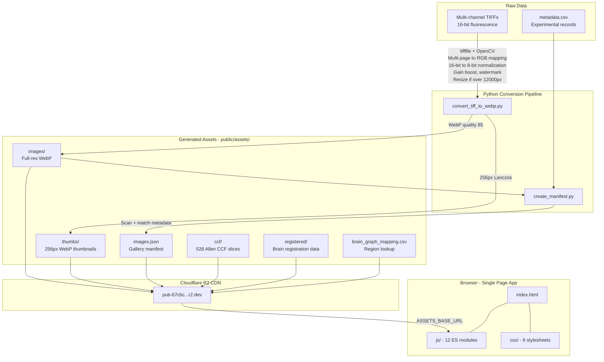
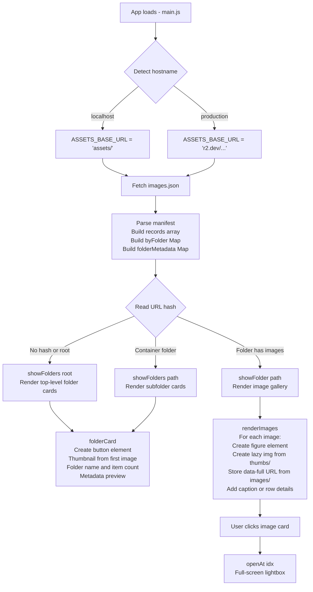
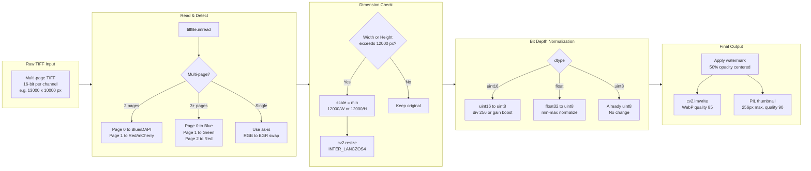
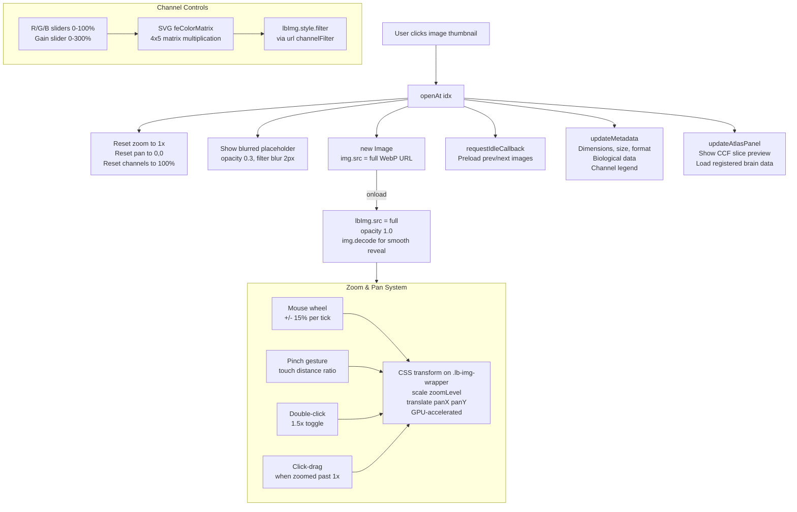

# AAV Gallery — Architecture & Image Gallery Deep Dive

This document provides a detailed explanation of how the image gallery is implemented, how large microscopy images are handled, and how the full data pipeline connects from raw TIFF files to browser rendering.

---

## End-to-End Pipeline Architecture



### Pipeline Summary

| Stage | Tool | Input | Output |
|-------|------|-------|--------|
| **1. Conversion** | `convert_tiff_to_webp.py` | Multi-channel TIFFs (16-bit, up to 13,000+ px) | Full-res WebP images + 256px thumbnails |
| **2. Manifest** | `create_manifest.py` | WebP images + `metadata.csv` | `images.json` (nested folder manifest) |
| **3. CDN Sync** | `rclone` via `sync_to_cloudflare_r2.bat` | `public/assets/` directory | Cloudflare R2 bucket |
| **4. Browser** | `js/main.js` + modules | `images.json` + WebP assets from CDN | Interactive gallery SPA |

---

## How the Image Gallery Works

The gallery is a two-tier system: **thumbnails** for browsing and **full-resolution images** for the lightbox viewer. Everything is rendered procedurally with vanilla JavaScript DOM manipulation across 12 ES modules — no frontend framework, no virtual DOM, no templates.

### Gallery Rendering Flow



### Step-by-Step Rendering

#### 1. Manifest Loading

On startup, `data.js` fetches `images.json` and builds three data structures:

```
records[]         — flat array of all image objects
byFolder (Map)    — folder path → array of images in that folder
folderMetadata (Map) — folder path → experimental metadata from CSV
```

#### 2. Folder Navigation (`showFolders` → `renderFolders` → `folderCard`)

When the user navigates to a folder:

1. **`showFolders(path)`** updates the title, subtitle (folder count), and breadcrumbs.
2. **`renderFolders(path)`** iterates child folders via `getChildFolders()`:
   - **Image folders** (have images) → create a `folderCard` with the first image as thumbnail.
   - **Container folders** (only subfolders) → create a `folderCard` with a folder SVG icon.
3. **`folderCard(path, count, isContainer)`** builds a `<button>` element:
   - Thumbnail: `` pointing to `ASSETS_BASE_URL + "thumbs/" + firstImage.thumb`
   - Metadata: genotype, enhancer, virus, dose, etc. from `folderMetadata` Map.

Navigation is **hash-based routing**: clicking a folder sets `location.hash = "#folder=AAV-BiPVe3/In vivo..."` and the `hashchange` listener re-renders.

#### 3. Image Gallery (`showFolder` → `renderImages`)

When the user enters a folder with images:

1. **`showFolder(path)`** detects images exist → switches from folder view to image view.
2. **`renderImages(imgs)`** builds the gallery:

```javascript
// For each image in the folder:
const im = document.createElement("img");
im.loading = "lazy";           // Browser-native lazy loading
im.decoding = "async";         // Non-blocking decode
im.src = ASSETS_BASE_URL + "thumbs/" + img.thumb;  // 256px thumbnail

const btn = document.createElement("button");
btn.setAttribute("data-full", ASSETS_BASE_URL + "images/" + img.src);  // Full-res URL stored
btn.appendChild(im);
```

Two view modes are available:
- **Grid view**: CSS Grid (`repeat(auto-fill, minmax(180px, 1fr))`) with thumbnail + caption.
- **Detail/row view**: Flexbox rows showing filename, dimensions, file size, last modified date.

#### 4. Lazy Loading Strategy

Thumbnails use browser-native lazy loading — no Intersection Observer, no JavaScript scroll handlers:

```html

```

The `width` and `height` attributes come from the manifest (`t_width`, `t_height`), giving the browser layout dimensions before the image loads to prevent content layout shift.

---

## How Large Images Are Handled

### Large Image Processing Pipeline



### Dimension Limit Details

```python
MAX_WEBP_DIMENSION = 12000  # Hard limit (WebP spec allows up to 16383)

if width > MAX_WEBP_DIMENSION or height > MAX_WEBP_DIMENSION:
    scale = min(MAX_WEBP_DIMENSION / width, MAX_WEBP_DIMENSION / height)
    new_width = int(width * scale)
    new_height = int(height * scale)
    img = cv2.resize(img, (new_width, new_height), interpolation=cv2.INTER_LANCZOS4)
```

The limit is set to 12,000px (not the WebP maximum of 16,383px) because OpenCV's WebP encoder has been observed to fail at dimensions near the theoretical maximum. Lanczos interpolation is used for the highest quality downscaling.

### Bit Depth Normalization

Fluorescence microscopy TIFFs are typically 16-bit (0–65,535 intensity range). The pipeline handles this two ways:

| Mode | Method | When to use |
|------|--------|-------------|
| **Standard** | Divide by 256 (`uint16 → uint8`) | Well-exposed images |
| **Gain boost** | Percentile-based contrast stretch (0.5th–99.5th percentile) | Dark/dim fluorescence images |

The gain boost stretches the actual signal range to fill the 0–255 output range, dramatically improving visibility of dim neural fluorescence.

### Multi-Page TIFF Channel Mapping

Microscopy TIFFs often store each fluorescence channel as a separate "page" (plane). The converter maps them to RGB:

| TIFF Pages | Blue (Page 0) | Green (Page 1) | Red (Page 2) |
|------------|--------------|-----------------|---------------|
| 2 pages | DAPI (nuclei) | — | mCherry (marker) |
| 3+ pages | DAPI (nuclei) | GFP/Cy5 (immunostain) | dTomato/mCherry (AAV) |

---

## Lightbox Image Viewer

The lightbox is the full-screen image viewer that opens when a user clicks on a gallery thumbnail.

### Lightbox Architecture



### Progressive Image Loading

The lightbox uses a **progressive loading** strategy to feel responsive even with large WebP files (5–20 MB):

1. **Instant feedback**: The lightbox opens immediately with a blurred, semi-transparent placeholder.
2. **Background fetch**: A new `Image()` object fetches the full-resolution WebP in the background.
3. **Smooth reveal**: On load, `img.decode()` ensures the browser has fully decoded the image before swapping it in (preventing a flash of partially-decoded content).
4. **Preloading**: `requestIdleCallback` prefetches the previous and next images during browser idle time, making arrow-key navigation feel instant.

### Zoom & Pan Implementation

Zoom and pan are implemented entirely through CSS transforms — no canvas rendering, no image slicing:

```javascript
function updateImageTransform() {
    lbImgWrapper.style.transform = `scale(${zoomLevel}) translate(${panX}px, ${panY}px)`;
}
```

The transform is applied to `.lb-img-wrapper` (a div wrapping both the `` and the regions overlay `<canvas>`). This means:

- **Image and overlay move together**: The brain atlas boundary overlay stays perfectly aligned with the image during zoom/pan.
- **GPU compositing**: CSS transforms are handled by the GPU compositor, not the main thread.
- **No resampling**: The browser displays the original pixels — zooming in reveals actual microscopy detail, not interpolated blur.

| Input | Zoom behavior |
|-------|--------------|
| Mouse wheel | ±15% per scroll tick, anchored to cursor position |
| Double-click | Toggle between 1.0× and 1.5× |
| Pinch (touch) | Continuous zoom based on finger distance ratio |
| Click-drag | Pan when zoomed > 1× |

### RGB Channel Controls

Fluorescence microscopy images encode different biological markers in each color channel. The channel controls let researchers isolate individual channels:

**Implementation**: A dynamically-created SVG `<feColorMatrix>` filter is applied to the `` element:

```
Matrix (with gain):
┌                              ┐
│ R×gain  0       0       0  0 │
│ 0       G×gain  0       0  0 │
│ 0       0       B×gain  0  0 │
│ 0       0       0       1  0 │
└                              ┘
```

Where R, G, B are 0.0–1.0 (from sliders) and gain is 0.0–3.0. This runs entirely on the GPU via the SVG filter pipeline — no pixel manipulation in JavaScript.

A **grayscale mode** converts using luminance weights: `0.299R + 0.587G + 0.114B`.

---

## Atlas Integration Architecture

The Allen Brain Atlas integration has three layers, each progressively more detailed:

| Layer | Name | Description |
|-------|------|-------------|
| 1 | CCF Slice Preview | Static WebP of the matching Allen CCF coronal slice |
| 2 | Interactive Registered | Experimental section warped into CCF space + 16-bit annotation overlay |
| 3 | Regions Overlay | CCF labels warped back into original image space (inverse transform) |

### 16-bit PNG Parser

The atlas annotation maps are 16-bit grayscale PNGs (each pixel value = a brain region parcellation index). Browsers cannot natively display 16-bit images, so `pngParser.js` includes a **custom PNG decoder**:

1. Verify PNG signature (8 bytes)
2. Parse IHDR chunk → width, height, bit depth (16), color type (grayscale)
3. Concatenate all IDAT chunks (compressed pixel data)
4. Decompress via `DecompressionStream` Web API (zlib/deflate)
5. Apply PNG row filters (None, Sub, Up, Average, Paeth) to reconstruct raw pixel data
6. Output: `Uint16Array` of parcellation label values

**Browser-friendly chunking**: The decoder processes 500 rows at a time, yielding to the browser via `requestAnimationFrame` between chunks. This prevents UI freezing on large annotation maps.

### Boundary Extraction

From the 16-bit label array, boundaries between regions are extracted by checking each pixel's label against its neighbors (right, below). Where labels differ, a boundary pixel is drawn with the region's atlas color. This produces:

- An `ImageData` for the boundary canvas overlay
- A downsampled copy of the annotation array for hover hit-testing

Both are cached so toggling the overlay on/off is instant.


---

## Component Interaction Summary

```
+------------------------------------------------------------------+
|                       Browser (index.html)                        |
|                                                                   |
|  +-------------+   +-----------------------------------------+   |
|  | URL Hash    |-->| js/ (12 ES modules, entry: main.js)      |   |
|  | #folder=... |   |                                          |   |
|  +-------------+   |  +----------+  +-----------+            |   |
|                     |  | byFolder |  | folderMeta|            |   |
|  +-------------+   |  |  (Map)   |  |   (Map)   |            |   |
|  | images.json  |-->|  +----+-----+  +-----+-----+            |   |
|  | (manifest)   |   |       |              |                  |   |
|  +-------------+   |  +----v--------------v----+             |   |
|                     |  |  renderFolders()       |             |   |
|                     |  |  renderImages()        |             |   |
|                     |  +-----------+------------+             |   |
|                     |              | click                    |   |
|                     |  +-----------v------------+             |   |
|                     |  |  openAt(idx)           |             |   |
|                     |  |  +-------------+       |             |   |
|                     |  |  | Lightbox    |       |             |   |
|                     |  |  | - zoom/pan  |       |             |   |
|                     |  |  | - channels  |       |             |   |
|                     |  |  | - atlas     |       |             |   |
|                     |  |  | - metadata  |       |             |   |
|                     |  |  | - regions   |       |             |   |
|                     |  |  +-------------+       |             |   |
|                     |  +------------------------+             |   |
|                     +-----------------------------------------+   |
|                                                                   |
|  +-------------+                                                  |
|  | css/        |  9 modules: dark theme, glass morphism,          |
|  | (9 files)   |  responsive grid, channel controls               |
|  +-------------+                                                  |
+------------------------------------------------------------------+
        |
        | ASSETS_BASE_URL (auto-detected)
        v
+-------------------------+
|  Cloudflare R2 CDN      |
|  or local assets/       |
|                         |
|  images/*.webp          |  <-- Full-resolution (up to 12,000px)
|  thumbs/*.webp          |  <-- 256px thumbnails
|  ccf/*.webp             |  <-- Allen atlas slices
|  registered/*.png       |  <-- 16-bit annotation maps
|  images.json            |  <-- Gallery manifest
+-------------------------+
```
